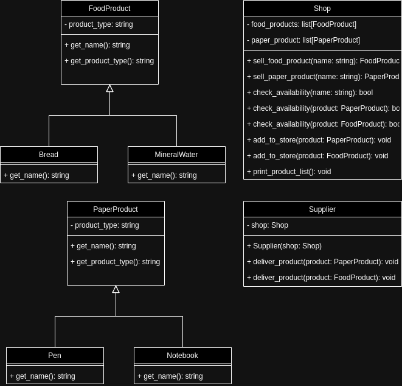

# pjf-lab2-b

## Opis projektu

Projekt polega na zaimplementowaniu prostego systemu sklepu na podstawie diagramu UML. W projekcie występują klasy reprezentujące produkty papiernicze i spożywcze, sklep oraz dostawcę. Celem jest odwzorowanie relacji i funkcjonalności zgodnie z diagramem, z uwzględnieniem ograniczeń języka Python.

## Wymagania

Zmodyfikuj **wyłącznie** plik `solution.py`.  
Pozostałe pliki służą do testowania poprawności rozwiązania.

## Klasy do zaimplementowania

- `PaperProduct` – klasa bazowa dla produktów papierniczych
- `FoodProduct` – klasa bazowa dla produktów spożywczych
- `Shop` – klasa reprezentująca sklep, przechowująca produkty i umożliwiająca ich sprzedaż
- `Supplier` – klasa dostawcy, umożliwiająca dostarczanie produktów do sklepu
- `Notebook` – zeszyt (produkt papierniczy)
- `Pen` – długopis (produkt papierniczy)
- `Bread` – chleb (produkt spożywczy)
- `MineralWater` – woda mineralna (produkt spożywczy)

## Wskazówki

- Python nie posiada wszystkich mechanizmów znanych z C++ (np. typowanie statyczne, dziedziczenie wielokrotne, metody wirtualne), dlatego implementacja może odbiegać od diagramu UML.
- Skup się na funkcjonalności i poprawnym działaniu testów jednostkowych.

## Testowanie

Do projektu dołączone są testy jednostkowe w plikach:
- `test_shop.py`
- `test_no_duplicates.py`

Aby uruchomić testy, wpisz w terminalu:

```bash
pytest
```

Możesz także uruchomić pojedynczy plik testowy:

```bash
python3 -m unittest test_shop.py
python3 -m unittest test_no_duplicates.py
```

## Diagram UML


